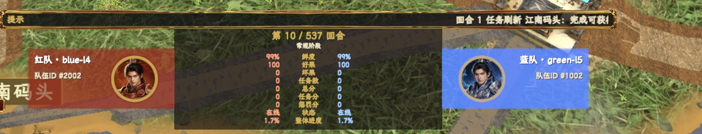
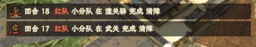

# 《一骑红尘：荔枝争运战》参赛任务书

## 目录

| 序号 | 章节 | 内容 |
|---:|---|---|
| 1 | 背景与胜负目标 | 故事背景、玩家目标、胜负方式和全局术语 |
| 2 | 地图与对战信息 | 地图公开信息、地图配置的固定项与可变项、站点路线、交互点、天气、对战面板和公开信息 |
| 3 | 队伍状态与可用资源 | 主车队、运送货物、可消耗资源、小分队和资源上限 |
| 4 | 基础动作规则 | 每帧动作、移动、处理、资源、验核、交付和动作失败 |
| 5 | 皇榜任务与窗口争夺 | 皇榜任务、任务刷新、任务争抢和窗口出牌 |
| 6 | 拦截、突破与终局急策 | 障碍、设卡、突破、悬赏、小分队行动和终局急策 |
| 7 | 结算与比赛规格 | 比赛结束、得分、未交付、惩罚、退赛和失联 |
| 8 | 局内规则速查表 | 动作额度、状态限制、资源、任务、得分、拒绝与非法动作快速索引 |
| 9 | 平台胜负判定与赛制积分 | 平台判定优先级、异常参赛、平分决胜和平台积分分配 |
| 10 | 参赛包提交与运行环境 | ZIP 包、启动脚本、平台启动方式、运行环境、依赖限制和自检清单 |

---

# 1. 背景与胜负目标

## 1.1 故事背景

《一骑红尘：荔枝争运战》是一场双队伍、600 个结算帧限时的贡运策略对抗赛。红方和蓝方各控制一支贡运队，从岭南出发，将荔枝运抵长安兴庆宫。

## 1.2 参赛任务

参赛选手需要编写程序，根据比赛目标和公开信息，控制主车队移动、处理皇榜任务、领取和使用资源、派出小分队，并根据结算结果调整策略。通信协议、消息格式、动作字段矩阵、状态字段和动作结果读取详见通信协议文档。

## 1.3 一局比赛的目标

目标是在比赛结束时获得更高的最终总分。胜负按下表判定，最终分数按第 7 章结算。

| 情况 | 局内结果 |
|---|---|
| 只有一方退赛 | 退赛方判负 |
| 双方同一结算帧退赛 | 本局无效且无胜方 |
| 双方都未退赛 | 比较最终总分；总分相同时本局直接判定平局 |

平台会在比赛结束后，根据最终总分、异常参赛状态和平分决胜规则，为双方分配赛制积分。平台胜负判定与赛制积分见第 9 章。

## 1.4 一局比赛的基础规则

一局比赛的基本流程：

```text
开局读取地图与公开状态
  |
  v
移动、处理、领取资源、完成皇榜任务
  |
  v
处理障碍、设卡、攻坚和窗口争夺
  |
  v
进入宫宴冲刺
  |
  v
S14 朱雀门完成宫门验核
  |
  v
S15 兴庆宫完成交付
  |
  v
计算最终总分与分项明细
```

基础规则：
- 开局时，每队有 100 篓好果、0 篓坏果、鲜度 100、8 名小分队人手和 4 点护卫行动点。
- 进入宫宴冲刺阶段后，S14 朱雀门才会开放宫门验核。
- 交付条件见 7.1。
- 比赛结束条件：双方都交付、单方退赛、双方同帧退赛，或第 600 结算帧结算完成。比赛结束后计算最终总分。最终总分由交付时间、交付时剩余好果、交付时剩余鲜度、任务分、悬赏分和惩罚分组成。
- 队伍成功交付后，不能再领取资源、完成皇榜任务或获得新的悬赏得分。交付后动作限制和违规处理见 7.4。
- 任务书提到的公开状态、公开库存和公开任务列表，均指系统向参赛程序公开的当前值。

## 1.5 全局单位与术语

比赛按结算帧推进，不按真实时间换算。

| 术语 | 含义 |
|---|---|
| 结算帧 / 结算帧编号 | 比赛推进的基本单位。每局最多 600 个结算帧；结算帧从 1 开始编号 |
| 开局状态 | 比赛开始时公开的本局地图、路线、资源、任务模板等初始信息 |
| 公开状态 | 每个结算帧的公开信息，参赛程序按公开状态判断队伍、地图、任务、资源、窗口和事件结果 |
| 交付时间 | 队伍成功交付时的结算帧编号。数值越小，表示交付越早 |
| 空动作 | 参赛程序本帧没有指定主车队动作，不是主动等待 |
| 主动等待 | 参赛程序提交 `WAIT`；路线边移动中提交 `WAIT` 会暂停本结算帧前进 |
| 系统等待 | 参赛程序未提交有效主车队动作，或主车队动作因同类冲突被取消时的默认处理 |
| 可用资源 / 可支配果品 | 当前公开状态中本队本帧可用于支付动作成本的资源、好果或坏果 |
| 任务模板 / 任务实例 | T01、T04 等是任务模板；比赛中实际处理的是任务实例，提交 `CLAIM_TASK` 时使用任务实例编号 |
| 处理帧数 | 领取资源、处理任务、清障、验核或固定处理所需等待的结算帧数 |

---

# 2. 地图与对战信息

## 2.1 地图公开信息

地图 Excel 只作为人工阅读辅助。选手可以查看站点位置、路线中心线、地形图例、交汇节点连接关系、路线编号对照和站点编号对照，实际结算以当前地图配置和公开状态为准。

比赛晋级过程会使用不同地图变体。比赛地图在开局时确定，局内保持固定。

当前地图 Excel 由以下区域组成，地图配置的固定项与可变项见 2.2：

| 区域 | 主要内容 | 用途 |
|---|---|---|
| 地形图例 | `1/2/3/4` 对应官道、水路、山路、支路 | 读取路线类型和移动耗时差异 |
| 玩家阅读版地图 | 路线中心线、站点编号和路线编号 | 确认站点和路线的空间关系；路线中心线只用于读图，不表示实际占格宽度 |
| 交汇节点连接关系 | 站点编号、站点名、连接路线类型和连接路线编号 | 快速确认某站连出哪些路线 |
| 路线编号对照 | 路线编号、起点、终点、路线类型、网格编号和路线距离 | 判断两站是否在该边连接；路线距离用于计算到站所需移动量，实际到站帧数还受每帧移动量、天气和加速影响 |
| 站点编号对照 | `S01-S15` 的站点编号、名称、类型和坐标 | 确认起点、宫门、终点及沿途站点位置 |


公开视图读取规则：

| 读取目标 | 查看位置 | 读取方式 |
|---|---|---|
| S03 是什么站点 | 地图的站点编号对照 | 找 `S03`，读取站点名、类型和坐标 |
| S03 是否可到 S07 | 地图的路线编号对照 | 找起终点包含 S03、S07 的路线；能否移动以当前状态显示的合法相邻节点为准 |
| 某路线距离是多少 | 地图的路线编号对照 | 读取该路线的类型和距离；路线边上禁止原路倒退 |
| 某区域受哪类天气影响 | 当前公开状态和天气规则 | 按当前公开状态和 2.5 的天气规则判断 |
| 某站能否领取资源或处理任务 | 当前公开状态、任务列表、资源库存和对应规则 | 按公开状态提交对应动作，不从地图图形自行推断 |

## 2.2 地图配置的固定项与可变项

规则固定项：

| 项目 | 固定规则 |
|---|---|
| 核心角色节点 | S01(5,50) 为起点、S14(76,18) 为宫门、S15(78,18) 为终点 |
| 节点编号集合 | 正式地图使用 S01-S15，不新增节点；站点编号、编码、站点名、类型和图标固定 |
| 路线类型枚举 | 只使用 `ROAD / WATER / MOUNTAIN / BRANCH` |
| 路线方向 | 提交移动前以本局合法相邻节点为准，单向路线只能按路线方向通行 |
| 处理机制 | 前段交接、登船处理、水路换运、入关交接、宫前交接、宫门验核等机制固定 |
| 资源机制 | 冰鉴、马类、船权、过所、官凭、情报等资源效果固定 |
| 任务规则 | 任务类型模板、任务分值和任务处理帧数固定 |
| 天气规则 | 天气类型和天气生成规则固定 |

地图可变项：

| 项目 | 规则 |
|---|---|
| 路线边清单 | 路线数量、端点、路线类型和路线距离以当前地图配置为准，合法相邻节点以公开状态为准 |
| 路线距离 | 不同地图里，路线距离可以不同；以当前地图配置为准 |
| 站点坐标 | S02-S13 坐标可以变化；S01、S14、S15 坐标按固定项保持不变 |
| 路线显示路径 | 路线绘制方式只用于显示；通行连接以当前地图配置的路线边清单为准 |
| 地图格子 | 地图总览、地形和站点对象格子可以变化，天气作用区域以当前公开状态为准 |
| 处理点绑定 | 哪些站点需要处理、处理类型、处理帧数和是否可能触发争夺窗口，以当前地图配置为准 |
| 资源投放清单 | 资源出现在哪些站点、每种资源数量和领取帧数，以当前地图配置为准 |
| 任务候选点 | 任务可以刷新在哪些站点可以变化 |
| 道路障碍候选点 | 道路障碍可以出现在哪些站点可以变化 |

## 2.3 站点与路线

### 2.3.1 起点、宫门与终点

固定起点、宫门与终点：

| 职责 | 节点 |
|---|---|
| 起点 | S01 岭南果园 |
| 宫门 | S14 朱雀门 |
| 终点 | S15 兴庆宫 |

当前安全区为 S15 兴庆宫。S15 不挂载设卡、攻坚、资源、任务、小分队、窗口出牌或道路障碍。未交付队伍位于 S15 时：

```text
未验核：只能等待（WAIT），或提交返回 S14 的移动
已验核，且满足交付条件：可以提交 DELIVER
已验核，但不满足交付条件：只能等待，或提交返回 S14 的移动
```

从 S15 返回 S14 使用兴庆宫特殊返回规则，返回时可以无视 S14 上的设卡和道路障碍，也不清除这些阻挡。

### 2.3.2 路线类型与路线距离

路线由两个规则量决定：路线距离和路线类型。路线距离是当前地图配置里每条路线边的长度值，选手在地图的“路线编号对照”中查看。

主车队在一条路线边上移动时，移动量关系如下：

| 影响项 | 含义 |
|---|---|
| 路线距离 | 当前路线边的配置长度值。距离越长，到站所需移动量越大；不按站点坐标距离或路线显示路径长度计算 |
| 路线耗时系数 | 每 1 点路线距离需要走多少移动量。其他条件相同时，数值越高，到站越慢 |
| 基础每帧移动量 | 没有加速时为 1000；快马、短程马和疾行令会提高这个数值 |
| 天气通行倍率 | 暴雨、山雾命中对应路线时，会降低本帧实际移动量。1000 表示不减速，数值越高，本帧走得越少 |

| 路线类型 | 路线类型标识 | 路线耗时系数（每 1 点路线距离所需移动量） | 每结算帧鲜度损耗 |
|---|---|---:|---:|
| 官道 | `ROAD` | 1380 | 0.055 |
| 水路 | `WATER` | 1250 | 0.045 |
| 山路 | `MOUNTAIN` | 1780 | 0.07 |
| 支路 | `BRANCH` | 1550 | 0.065 |

策略支路（`BRANCH`）用于转线和改变交锋位置。皇榜任务刷新仍按 ROAD / WATER / MOUNTAIN 三类路线选择目标；支路不会单独作为任务刷新分类。支路上的动作和结算机制沿用基础规则。

快马、短程马和疾行令不改变到站所需移动量，只改变基础每帧移动量。

| 状态 | 基础每帧移动量 |
|---|---:|
| 无加速 | 1000 |
| 快马（`FAST_HORSE`） | 1200 |
| 短程马（`SHORT_HORSE`） | 1150 |
| 疾行令（`RUSH_SPEED`） | 1300 |

移动结算使用两个量：

```text
到站所需移动量 = 向上取整（路线距离 × 路线耗时系数）
每帧移动量 = 向下取整（基础每帧移动量 × 1000 ÷ 当前天气通行倍率）
```

| 天气情况 | 当前天气通行倍率 |
|---|---:|
| 无影响天气、未命中天气、酷暑 | 1000 |
| 暴雨实际命中水路移动 | 1350 |
| 山雾实际命中山路移动 | 1100 |

实际命中的天气和加速只影响当前结算帧的每帧移动量，已经走过的移动量不影响。清障残留通行税、设卡时间税和障碍时间税按各自规则单独结算。

### 2.3.3 双向通行与合法相邻节点

主车队之间没有物理碰撞。双方可以同时停在同一节点，也可以同时位于同一路线边。普通移动是否受阻只看敌方有效设卡、道路障碍、宫门验核等移动规则；窗口争夺和处理占用只影响对应的处理或出牌动作。

合法相邻节点只看当前地图配置的路线边清单。每条路线边都有固定的两个端点：边起点和边终点。这里的边起点、边终点只表示这条路线边的方向，不是整局比赛的起点和终点。

| 当前节点在这条路线边上的位置 | 这条路线边 | 另一端是否是相邻节点 |
|---|---|---|
| 边起点 | 单向或双向 | 是 |
| 边终点 | 双向 | 是 |
| 边终点 | 单向 | 否 |

路线边只连接自己的边起点和边终点。路线显示路径中的中间坐标点只用于画线，不是站点，也不能作为 `MOVE` 目标。移动中可以用 `WAIT` 暂停在路线边上，但不能在中间坐标点执行站点动作。

## 2.4 地图上的交互点

地图交互点包括固定处理站点、资源点、任务候选点和障碍点。

### 2.4.1 固定处理站点

固定处理站点是主车队到达后需要完成固定流程的站点，例如前段交接、登船处理等。处理动作挂载站点、处理类型和处理帧数以当前地图配置和公开状态为准。

当前基础地图固定处理站点示例：

| 节点 | 处理内容 | 处理类型 | 提交动作 | 处理帧数 | 是否可能触发争夺窗口 |
|---|---|---|---|---:|---|
| S02 南岭驿 | 前段交接 | `TRANSFER` | `PROCESS` | 4 个结算帧 | 是 |
| S04 江南码头 | 登船处理 | `BOARD` | `PROCESS` | 7 个结算帧 | 是 |
| S05 洞庭水驿 | 水路换运 | `WATER_TRANSFER` | `PROCESS` | 6 个结算帧 | 是 |
| S11 潼关驿 | 入关交接 | `PASS_TRANSFER` | `PROCESS` | 5 个结算帧 | 是 |
| S13 灞桥驿 | 宫前交接 | `PALACE_TRANSFER` | `PROCESS` | 5 个结算帧 | 是 |
| S14 朱雀门 | 宫门验核 | `VERIFY` | `VERIFY_GATE` | 6 个结算帧 | 是 |

固定处理完成后才能移动离站；但队伍仍可等待，或执行该站允许的资源、任务、清障等动作。离开固定处理站点后再次到达同一站点，需要重新完成该站处理。

### 2.4.2 资源点

资源投放站点、资源数量和领取帧数以当前地图配置和公开库存为准。资源效果固定。

当前基础地图资源投放示例：

| 站点 | 可领取资源 | 领取帧数 |
|---|---|---:|
| S03 梅关驿 | 冰鉴（`ICE_BOX`）×1、过所（`PASS_TOKEN`）×1、情报（`INTEL`）×1 | 2 个结算帧 |
| S04 江南码头 | 短程马（`SHORT_HORSE`）×1、船权（`BOAT_RIGHT`）×1、情报（`INTEL`）×1 | 2 个结算帧 |
| S06 五岭山道 | 冰鉴（`ICE_BOX`）×1、情报（`INTEL`）×1 | 2 个结算帧 |
| S08 秦岭栈道 | 短程马（`SHORT_HORSE`）×1、过所（`PASS_TOKEN`）×1、情报（`INTEL`）×1 | 2 个结算帧 |
| S07 荆襄大驿 | 冰鉴（`ICE_BOX`）×1、短程马（`SHORT_HORSE`）×1 | 2 个结算帧 |
| S09 洛阳驿 | 快马（`FAST_HORSE`）×1、官凭（`OFFICIAL_PERMIT`）×1 | 2 个结算帧 |
| S10 武关 | 情报（`INTEL`）×1 | 2 个结算帧 |
| S11 潼关驿 | 情报（`INTEL`）×1 | 2 个结算帧 |
| S13 灞桥驿 | 过所（`PASS_TOKEN`）×1、官凭（`OFFICIAL_PERMIT`）×1、情报（`INTEL`）×1 | 2 个结算帧 |

### 2.4.3 任务候选点

任务候选点决定皇榜任务可以刷新在哪些站点。任务分布以当前地图配置和公开任务列表为准。任务刷新、过期、完成和争抢规则详见第 5 章。

当前基础地图任务候选点示例：

| 任务 | 候选节点 |
|---|---|
| T01 | S03 |
| T02 | S07、S10 |
| T04 | S06、S08 |
| T06 | S09、S04、S06 |
| T08 | S04、S05 |
| T11 | S08、S10、S11 |
| T12 | S11、S13 |
| T13 | S13、S09、S12 |
| T14 | S10、S11、S12 |

### 2.4.4 障碍点

道路障碍会阻挡进入目标站点，障碍按站点挂载，比赛开局时生成，中途不会随机新增。主车队清障（`CLEAR`）、小分队清障或 T04 完成后，会清除目标障碍。目标站点存在道路障碍时，不可以使用普通移动（`MOVE`）到达该站点，必须通过提交主车队清障（`CLEAR`）、处理 T04、派小分队清障、强制通行或改走其他路线。

| 看到的信息 | 代表什么 | 可提交动作 |
|---|---|---|
| 当前状态显示某站存在道路障碍 | 道路障碍正在该站生效 | 主车队清障（`CLEAR`）、小分队清障、处理对应 T04 清障任务、或 强制通行（`FORCED_PASS`） |

T04 表示任务模板编号，具体执行清障任务时需要使用任务列表中的任务实例编号提交。

道路障碍候选点以当前地图配置为准，相邻站点以当前地图配置的路线边清单为准。

当前基础地图的道路障碍候选节点和相邻站点如下，实际障碍类型和是否存在障碍以公开状态为准：

| 挂载站点 | 相邻站点 | 规则影响 |
|---|---|---|
| S06 五岭山道 | S01、S03、S08 | 阻挡山路入口，可作为 T04 清障目标 |
| S08 秦岭栈道 | S06、S07、S09、S10 | 阻挡山路中段，影响武关与转线路线 |
| S10 武关 | S08、S09、S11 | 阻挡关键关隘，可作为 T11 / T14 目标 |
| S11 潼关驿 | S10、S12 | 阻挡终段入关路线 |

## 2.5 天气区域与天气效果

每局固定触发 4 次天气事件，每次持续 60 个结算帧。
开始结算帧范围是公开规则，某次天气进入预告期后，双方看到该次天气的精确开始结算帧、持续帧数和作用区域。完整的未来天气排期、天气池数量、天气池分布均为不公开信息。

| 天气序号 | 开始结算帧范围 |
|---:|---|
| 第 1 次 | 80-120 |
| 第 2 次 | 200-240 |
| 第 3 次 | 320-360 |
| 第 4 次 | 440-480 |

天气提前 30 个结算帧预告，当前天气、预告天气和生效区域以当前公开状态为准。天气从开始结算帧起生效，持续到“开始结算帧 + 持续帧数 - 1”的结算帧，同一结算帧最多只有 1 个天气事件生效。

天气效果是否生效，以每帧当前公开状态为准。
天气效果未命中时，天气通行倍率为 1000，鲜度系数为 ×1，处理加时为 0。
天气效果命中时，效果如下：

| 天气 | 作用范围 | 鲜度系数 | 移动 / 处理影响 |
|---|---|---:|---|
| 酷暑（`HOT`） | 全图 | ×1.5 | 天气通行倍率 1000，无附加处理帧数 |
| 暴雨（`HEAVY_RAIN`） | 水路 / 码头 | 暴雨区域内移动、登船处理、水路换运时 ×1.3 | 命中水路移动时，天气通行倍率 1350；命中登船处理或水路换运处理时，处理帧数各 +4 |
| 山雾（`MOUNTAIN_FOG`） | 山路 / 山区节点 | ×1 | 命中山路移动时，天气通行倍率 1100；命中小分队探路时，`SQUAD_SCOUT` 延迟 +2 个结算帧 |
天气类型和生效区域以当前公开状态为准，酷暑（`HOT`）实际生效时按全图结算。

## 2.6 对战面板与公开信息

每个结算帧的公开状态用于判断队伍状态、地图状态、任务争夺和事件结果。对战面板展示公开状态的概览，面板中的“回合”与本任务书的结算帧编号含义相同。参赛程序按当前公开状态提交动作，最终分数和胜负以比赛结束结果为准。

| 区域 | 信息范围 |
|---|---|
| 回合与阶段 | 当前结算帧、对局进度、当前阶段 |
| 双方状态 | 队伍身份、主车队状态、位置和路线进度 |
| 资产与分数 | 货物、资源、分数预览 |
| 任务与争夺 | 公开任务状态、当前悬赏、当前争夺窗口 |
| 天气与地图 | 当前天气、已预告天气、公开地图状态 |
| 事件通知 | 任务刷新、任务完成、行动结果、天气命中等公开事件 |





比赛中显示的分数是预览值。最终总分和分项明细以比赛结束结果为准。
重播、暂停、播放速度和进度条只控制回放查看，不改变公开状态和结算结果。
红蓝双方使用同一公开视图。以下状态公开：

```text
当前结算帧和当前阶段
双方队伍状态
双方资产和分数预览
公开地图状态
当前任务
当前悬赏
当前窗口
当前天气
已进入预告期的天气
公开事件
```

以下内容不提前公开：

```text
完整未来天气排期
未进入预告期的未来天气
完整随机种子
未刷新的未来皇榜任务
敌方尚未公开的本帧动作
```

---

# 3. 队伍状态与可用资源

## 3.1 主车队

每队可控制、可携带、可消耗的对象包括主车队、随车货物、随车资源、小分队和护卫行动点。每队只有一支主车队，货物和资源都跟随主车队，小分队与护卫行动点是独立战术资产。终局急策不是随车资源，属于宫宴冲刺阶段开放的特殊动作机会，规则见 6.5。

| 层级 | 内容 | 主要用途 |
|---|---|---|
| 主行动单位 | 主车队 | 移动、处理、领取资源、完成任务、清障、设卡、攻坚、验核、交付 |
| 随车货物 | 好果、坏果、鲜度、冻结好果 | 决定交付质量，也可作为部分动作成本 |
| 随车资源 | 冰鉴、马、船权、过所、官凭、情报 | 保鲜、加速、码头资源标记、窗口出牌、探路 |
| 远程战术资产 | 小分队人手 | 探路、远程清障、增援己方设卡、削弱敌方设卡 |
| 窗口战术资产 | 护卫行动点 | 支付窗口牌兵争（`BING_ZHENG`） |
| 特殊动作机会 | 终局急策 | 宫宴冲刺阶段使用疾行令、护果令或破关令 |

主车队状态包括：

| 中文状态 | 程序状态 | 含义 |
|---|---|---|
| 空闲 | `IDLE` | 可提交合法主车队动作 |
| 移动中 | `MOVING` | 正在沿路线前进 |
| 主动等待 | `WAITING` | 提交主动等待（WAIT）动作后停在路线边上，已走移动量不增不减 |
| 处理中 | `PROCESSING` | 正在处理站点、资源、任务或清障 |
| 窗口争夺中 | `CONTESTING` | 正在参与 3 拍窗口 |
| 休整中 | `RESTING` | 攻坚失败、窗口平局等导致的短暂停顿 |
| 强制通行中 | `FORCED_PASSING` | 正在通过强制通行穿越设卡或障碍 |
| 宫门验核中 | `VERIFYING` | 正在完成宫门验核 |
| 冻结好果被清算 | `COST_BANKRUPT` | 冻结好果在处理完成前被鲜度清算扣掉，本次处理失败、不产生收益，下一次动作按所在节点的空闲规则提交 |
| 已交付 | `DELIVERED` | 已完成终点交付 |
| 已退赛 | `RETIRED` | 连续缺动作达到退赛条件后，不再参与正常结算 |

## 3.2 运送货物

初始货物：

| 项目 | 初始值 | 规则意义 |
|---|---:|---|
| 好果 | 100 篓 | 计入交付，也可支付设卡、攻坚、献贡、终局急策等成本 |
| 坏果 | 0 篓 | 不计入好果分，可用于攻坚 |
| 鲜度 | 100 | 计入鲜度品质分 |
| 冻结好果 | 0 | 主车队处理中已冻结，等待扣除使用，但尚未最终扣除的好果 |

### 3.2.1 好果和坏果

- 好果总量指可支配好果和冻结好果之和。冻结好果是当前主车队处理中已占用、尚未最终扣除的好果，冻结期间不计入可支配好果。
- 坏果只记录数量，不记录鲜度。
- 鲜度**首次**低于以下任一数值时，触发1 篓好果转为 1 篓坏果。
注意：等于阈值时不触发转坏，结算后低于阈值才触发。若同一结算帧扣鲜度后首次低于多个尚未触发的数值，按这些数值各触发 1 次。

```text
90、80、70、60、50、40、30、20、10
```

好果转坏和鲜度归零会遵从下表顺序完成处理：

| 顺序 | 情况 | 规则 |
|---:|---|---|
| 1 | 触发好果转坏 | 先转可支配好果，可支配好果不足时，再转冻结好果 |
| 2 | 好果转坏使用冻结好果 | 转坏优先生效，正在使用这部分冻结好果的处理失败，不产生收益，已损失的好果不返还 |
| 3 | 好果总量变为 0 | 鲜度记为 0，坏果保留 |
| 4 | 鲜度降为 0 后仍有好果 | 本结算帧后剩余好果全部报废，不增加坏果 |
| 5 | 鲜度归零报废包含冻结好果 | 报废优先生效，正在使用这部分冻结好果的处理失败，不产生收益，已损失的好果不返还 |

### 3.2.2 鲜度

鲜度每个结算帧结束时扣除：本帧鲜度扣除值 = 每帧基础鲜度扣除值 × 天气鲜度系数 × 急策鲜度系数。鲜度结算后限制在 0-100。

| 当前状态 | 每帧基础鲜度扣除值 |
|---|---:|
| 停靠、主动等待、处理、验核、窗口争夺、休整、强制通行额外等待 | 0.05 |
| 官道移动 | 0.055 |
| 水路移动 | 0.045 |
| 山路移动 | 0.07 |
| 支路移动 | 0.065 |
| 普通移动中实际走路线边 | 按对应路线类型取值 |
| 普通移动到达目标节点的结算帧 | 按本帧实际完成的路线类型取值 |
| 强制通行中实际走路线边 | 按对应路线类型取值 |
| 强制通行到达目标节点的结算帧 | 0.05 |

| 命中条件 | 鲜度扣除系数 |
|---|---:|
| 酷暑（`HOT`）生效中，全图 | ×1.5 |
| 暴雨（`HEAVY_RAIN`）生效中，区域内 | ×1.3 |
| 山雾（`MOUNTAIN_FOG`）生效中，区域内 | ×1 |
| 疾行令（`RUSH_SPEED`）生效中 | ×1.25 |
| 护果令（`RUSH_PROTECT`）生效中 | ×0.2 |

## 3.3 可消耗资源

资源效果：

| 资源 | 标识 | 规则 |
|---|---|---|
| 冰鉴 | `ICE_BOX` | 使用成功时，先将鲜度 +10，上限 100，再进行本结算帧鲜度扣除；鲜度已为 0 时使用会被拒绝 |
| 快马 | `FAST_HORSE` | 使用后 20 个结算帧内，基础每帧移动量变为 1200 |
| 短程马 | `SHORT_HORSE` | 使用后 14 个结算帧内，基础每帧移动量变为 1150 |
| 船权 | `BOAT_RIGHT` | 码头资源标记；可以领取入库，不支持主动使用 |
| 过所 | `PASS_TOKEN` | 文书类资源；可支付窗口牌“验牒”（`YAN_DIE`） |
| 官凭 | `OFFICIAL_PERMIT` | 文书类资源；可支付窗口牌“验牒”（`YAN_DIE`） |
| 情报 | `INTEL` | 给近距离目标节点添加己方探路标记；本队后续在该节点的适用处理帧数减少 3 个结算帧，最低 2 个结算帧，完整规则见 6.4.1 |

### 3.3.1 保鲜资源

- 冰鉴只提高当前鲜度，不重置已经触发过的好果转坏果记录，也不会把坏果转回好果。若本帧成功使用冰鉴，鲜度先 +10，上限 100；之后按本帧规则扣除鲜度，并判断好果转坏和鲜度归零。

### 3.3.2 移动资源

- 快马（`FAST_HORSE`）持续 20 个结算帧，短程马（`SHORT_HORSE`）持续 14 个结算帧。二者不叠加，新的马类效果会覆盖旧的马类效果。马类资源使用成功当帧立即生效，若本帧有移动结算，使用新的每帧移动量。
- 疾行令（`RUSH_SPEED`）不覆盖马类效果，二者冲突。已有马类效果时使用疾行令会失败，但不消耗终局急策次数和好果；疾行令生效中使用快马或短程马会失败，但不消耗对应马类资源。

### 3.3.3 文书资源

- 过所和官凭都可以支付验牒（`YAN_DIE`）成本。参赛程序提交验牒时，系统自动消耗 1 个可用文书资源。若参赛程序主动使用过所或官凭，资源会被扣除且不产生验牒效果，已扣资源不返还。

### 3.3.4 情报

- 情报（`INTEL`）只能在主车队停靠在节点时使用，路线边移动中或路线边主动等待时，不能使用情报。使用情报不会改变主车队位置，只会在目标节点添加本队探路标记，探路标记规则见 6.4.1。

| 规则点 | 规则 |
|---|---|
| 提交要求 | 必须指定目标节点 |
| 距离口径 | 从主车队当前节点到目标节点，沿当前公开路线边累计路线距离，可达路线有多条时，取累计距离最小值，不看坐标直线距离 |
| 距离上限 | 当前上限为 15；目标距离超过 15 时，情报使用被拒绝，不添加探路标记，也不消耗情报 |

### 3.3.5 护卫行动点

护卫行动点用于支付窗口出牌中的兵争牌（`BING_ZHENG`）。

| 规则点 | 规则 |
|---|---|
| 初始与用途 | 每队 4 点，只用于支付窗口出牌中的兵争牌（`BING_ZHENG`） |
| 消耗与不足 | 每提交 1 次兵争牌消耗 1 点；点数不足时，兵争牌失效，本次窗口出牌按弃权（`ABSTAIN`）处理 |
| 返还与共用 | 已消耗的护卫行动点不返还、不恢复；不与小分队人手共用，不能互相替代 |

## 3.4 小分队

每队初始小分队人手为 8。每个结算帧最多提交 1 个小分队动作；提交 2 个及以上时，本帧小分队动作都不执行，不消耗人手，并按 1 次普通非法动作计数。人手不足时，本次小分队动作被拒绝，不扣人手。
小分队动作的目标校验、延迟和落地顺序见 6.4。

小分队动作：

| 动作 | 消耗人手 | 效果 |
|---|---:|---|
| 小分队探路（`SQUAD_SCOUT`） | 1 | 对目标节点添加与情报相同的己方探路标记 |
| 小分队清障（`SQUAD_CLEAR`） | 2 | 延迟清除目标道路障碍，本队成为清障方，不算完成 T04 清障任务；非清障方在清障方清障完成后 30 个结算帧内通过原障碍节点时，需要多付 6 个结算帧通行时间 |
| 小分队增援（`SQUAD_REINFORCE`） | 2 | 己方有效设卡防守值 +2，不超过该节点防守上限 |
| 小分队削弱（`SQUAD_WEAKEN`） | 2 | 敌方有效设卡防守值 -2，最低降到 0，防守值降为 0 后，该设卡不再阻挡通行 |


## 3.5 获取、消耗与上限

资源携带没有额外背包上限，本队持有量以公开状态为准，领取成功增加资源，使用成功消耗资源。资源领取详细规则见 4.4。

“可用资源”“可支配好果 / 坏果”均以当前公开状态中本队本帧可用于支付的数量为准。资源不足时，按对应动作的拒绝、失败或窗口弃权规则处理。

---

# 4. 基础动作规则


## 4.1 每帧动作上限

每个结算帧内，每队按动作类别分别计算提交上限。不同类别不互相占用额度；同一类别最多提交 1 个。

| 动作类别 | 本帧最多提交 |
|---|---:|
| 主车队动作 | 1 个 |
| 小分队动作 | 1 个 |
| 窗口出牌动作 | 1 个 |
| 终局急策动作 | 1 个 |

- 同一动作类别提交超过上限时，该类别本帧全部不执行，并按 1 次普通非法动作计数，不按提交条数重复计数。窗口出牌动作超过上限时，本次窗口出牌按弃权（`ABSTAIN`）处理。
- 终局急策动作整局每队最多使用 1 次。疾行令（`RUSH_SPEED`）和护果令（`RUSH_PROTECT`）按主车队动作提交，同时占用终局急策额度；破关令（`BREAK_ORDER`）不能单独提交，只能随攻坚破卡（`BREAK_GUARD`）或宫门验核（`VERIFY_GATE`）这两个主车队动作一起提交，并占用终局急策额度。
- 窗口出牌动作只在本队正在窗口争夺、且本帧允许出牌时有效；其他时候提交窗口出牌不生效且不扣成本。
- 小分队动作：小分队探路（`SQUAD_SCOUT`）、小分队清障（`SQUAD_CLEAR`）、小分队增援（`SQUAD_REINFORCE`）、小分队削弱（`SQUAD_WEAKEN`）。
- 主车队动作：

| 中文动作 | 程序动作 | 用途 |
|---|---|---|
| 等待 | `WAIT` | 主动等待，移动中会暂停本结算帧前进 |
| 移动 | `MOVE` | 前往合法相邻节点 |
| 通用处理 | `PROCESS` | 处理当前站点配置的处理点 |
| 领取资源 | `CLAIM_RESOURCE` | 在资源点领取资源 |
| 使用资源 | `USE_RESOURCE` | 使用已持有资源 |
| 处理皇榜任务 | `CLAIM_TASK` | 完成指定任务并获得任务分 |
| 主车队清障 | `CLEAR` | 启动时占用 1 篓可支配好果；6 个结算帧处理完成后扣除该好果并清除道路障碍，不算完成 T04 清障任务 |
| 设卡 | `SET_GUARD` | 在当前节点建立己方设卡 |
| 攻坚破卡 | `BREAK_GUARD` | 攻击敌方设卡 |
| 强制通行 | `FORCED_PASS` | 支付时间税通过设卡或障碍 |
| 宫门验核 | `VERIFY_GATE` | 宫宴冲刺后在宫门完成交付前验核 |
| 交付 | `DELIVER` | 在终点完成最终交付 |

## 4.2 等待与移动

移动必须满足：

```text
目标节点是当前合法相邻节点（合法相邻节点定义见 2.3.3）
目标节点没有阻止本次通行的敌方设卡、道路障碍或宫门验核限制
当前节点到目标节点存在路线边，若路线为单向，必须符合起点到终点方向
当前节点没有未完成的固定处理
```


队伍位于 S15 兴庆宫且需要返回 S14 朱雀门时，按 2.3.1 的兴庆宫特殊返回规则处理，返回时可以无视 S14 上的设卡和道路障碍，也不清除这些阻挡。

`MOVE` 的目标按主车队位置判断：

- 停在节点上：`MOVE` 目标 = 当前节点的合法相邻节点。
- 已经在路线边上：本段路线起点 = 进入当前路线边时离开的节点；当前目标节点 = 当前这段路线按行进方向要到达的端点；`MOVE` 目标 = 当前目标节点，或本段路线起点的其他合法相邻节点。

移动补充规则：
```text
对方队伍正在节点领取资源、处理任务或处理固定流程时，本队仍可用 `MOVE` 到达该节点。
主车队已在路线边上时，`MOVE` 只能提交当前目标节点，或提交本段路线起点的其他合法相邻节点改道，不能提交本段路线起点原路返回。改道会放弃旧路线进度，新路线进度从 0 开始。
主车队已在路线边上时，`WAIT` 表示本结算帧不前进，已暂停的继续暂停。
休整中（RESTING）只能 `WAIT` 或不提交动作，其他动作不生效，休整倒计时照常减少。
```

## 4.3 站点处理

按当前位置提交对应处理动作，处理规则：

```text
处理类型由当前节点和当前公开状态决定
固定处理站点（如登船处理 `BOARD`）提交 `PROCESS`
`PROCESS` 的目标必须是当前节点；目标不是当前节点时会被拒绝
处理机制固定，处理点挂载站点、处理类型和处理帧数以公开状态为准
处理被中断后，本次处理结束，进度清零
```

特殊站点：S14 宫门验核提交 `VERIFY_GATE`。

## 4.4 领取资源与使用资源

领取资源（`CLAIM_RESOURCE`）时，目标节点必须等于主车队当前节点，且该节点有对应资源库存。

资源效果固定，资源投放站点、数量和领取帧数以当前地图配置为准；当前可领取库存以公开库存为准。

使用资源必须指定资源类型；对节点生效的资源，必须同时指定目标节点。例如，使用情报（`INTEL`）时，需要指定探路目标节点。

资源领取规则：

| 场景 | 处理结果 |
|---|---|
| 目标节点 = 当前节点，且该节点有对应资源库存 | 开始领取该资源 |
| 领取成功 | 目标节点该资源库存 -1，本队该资源 +1 |
| 位置不符、库存不足、资源类型缺失或目标节点没有该资源 | 本次领取失败，不获得资源，不计非法动作 |
| 处理完成时库存不足 | 本次领取失败，不获得资源，不计非法动作 |
| 同一队伍领取不同资源类型 | 每种资源类型分别提交领取动作，领取开始和处理完成时都要求该站该资源仍有库存 |
| 背包上限 | 无额外上限，持有数量由地图库存、领取结果和使用消耗决定 |


资源使用规则按主车队当前状态判断：

| 主车队状态 | 资源使用规则 |
|---|---|
| 停靠在节点 | 可以使用资源 |
| 路线边移动中或路线边主动等待 | 只能使用马类资源，非马类资源会被拒绝且不消耗 |
| 正在处理站点、宫门验核或强制通行 | 使用资源不生效，不消耗资源，不计非法动作，当前处理继续 |
| 休整中 | 使用资源被拒绝，不消耗资源，不计非法动作，休整倒计时继续 |

马类资源使用成功时，不改变当前目标节点，本帧仍按当前方向结算路线移动。资源效果见 3.3。

## 4.5 宫门验核与终点交付

宫门验核必须同时满足：

| 要求 | 规则结果                                                     |
| -------- | ------------------------------------------------------------ |
| 比赛阶段 | 只能在宫宴冲刺阶段提交；普通阶段不进入处理，不创建宫门窗口，不消耗破关令或探路标记 |
| 队伍位置 | 主车队位于 S14                                               |
| 验核状态 | 队伍尚未完成验核                                             |
| 队伍状态 | 不在移动、窗口争夺、休整、强制通行、通用处理或宫门验核中     |


提交交付（`DELIVER`）时，必须同时满足下表全部交付条件：

| 交付条件 | 不满足时的交付结果 | 惩罚计数 |
|---|---|---|
| 主车队位于 S15 兴庆宫 | 不完成交付 | 不计普通非法动作 |
| 已完成宫门验核，且已验核状态已经生效 | 不完成交付 | 不计普通非法动作 |
| 队伍尚未交付 | 不重复结算交付 | 不计交付后违规惩罚 |
| 剩余好果大于 0 | 不完成交付 | 不计普通非法动作 |
| 鲜度大于 0 | 不完成交付 | 不计普通非法动作 |


如果队伍处于下列状态，本帧不能执行交付：

| 队伍状态 | 规则结果 |
|---|---|
| 正在移动中 | 不进入交付结算 |
| 正在休整中 | 不进入交付结算，休整继续推进 |
| 正在处理、强制通行或宫门验核中 | 原处理继续推进，不进入交付结算 |
| 正在窗口争夺中 | 按窗口争夺处理，不进入交付结算 |

# 5. 皇榜任务与窗口争夺

## 5.1 皇榜任务规则

| 规则点 | 规则 |
|---|---|
| 任务生成 | 皇榜任务由任务模板生成，并以任务实例形式出现在任务列表中 |
| 任务实例 | 每个任务实例都有本局唯一的任务实例编号、任务模板、目标节点和过期帧 |
| 提交动作 | 处理任务时提交 `CLAIM_TASK`，并指定任务实例编号 |
| 同时处理 | 主车队同一时间只能处理 1 个任务实例；任务列表里可以同时有多个可选任务实例，但每次只能选择 1 个提交处理 |
| 处理位置 | 除 T04 清障任务外，主车队必须停在任务实例的目标节点才能处理；T04 可在目标障碍节点或相邻节点处理 |
| 重复处理 | 同一任务实例完成后，后续重复处理会被拒绝 |

## 5.2 任务模板、分值与处理帧数

| 任务 | 名称 | 完成条件 | 分值 | 处理帧数 |
|---|---|---|---:|---:|
| T01 | 限时过关 | 主车队位于目标节点并完成 `CLAIM_TASK` 处理 | 30 | 3 |
| T02 | 抵驿催运 | 主车队位于目标驿站并完成 `CLAIM_TASK` 处理 | 30 | 4 |
| T04 | 清障任务 | 主车队在目标障碍节点或相邻节点完成 `CLAIM_TASK` 处理，并同步清障 | 30 | 6 |
| T06 | 争马换乘 | 主车队位于目标节点；启动任务时消耗 1 个快马（`FAST_HORSE`）或短程马（`SHORT_HORSE`），并完成 `CLAIM_TASK` 处理 | 30 | 3 |
| T08 | 码头争船 | 主车队位于目标节点并完成 `CLAIM_TASK` 处理 | 30 | 4 |
| T11 | 栈道复核 | 主车队位于目标节点并完成 `CLAIM_TASK` 处理 | 30 | 4 |
| T12 | 官道关验 | 主车队位于目标节点并完成 `CLAIM_TASK` 处理 | 15 | 5 |
| T13 | 水陆联运 | 主车队位于目标节点并完成 `CLAIM_TASK` 处理 | 15 | 5 |
| T14 | 山口急递 | 主车队位于目标节点并完成 `CLAIM_TASK` 处理 | 15 | 5 |

注意 T04 清障任务规则：

| 场景 | 结果 |
|---|---|
| 用 `CLAIM_TASK` 完成 T04 | 获得 T04 任务分，并清除目标障碍 |
| 用主车队清障（`CLEAR`）或小分队清障清除目标障碍 | 只清除障碍，不完成 T04，不获得 T04 任务分 |
| T04 的目标障碍已被非 T04 方式清除 | 该 T04 失败，不重新刷新替代任务 |
| 从相邻节点完成 T04 | 获得 T04 任务分，并清除目标障碍，主车队仍停在原节点 |

## 5.3 任务刷新与过期

| 规则点 | 规则 |
|---|---|
| 当前可处理任务 | 以当前公开任务列表为准 |
| 刷新规则 | 普通皇榜任务的刷新时机和刷新结果以当前地图配置和公开状态为准 |
| 任务列表上限 | 当前任务池最多保留 18 个仍活跃、未完成、未失败的普通皇榜任务 |
| 可处理任务上限 | 同一时刻最多有 10 个普通皇榜任务处于可直接处理状态 |
| 任务过期帧 | 到达任务过期帧后，该任务失效，不能再处理或争夺 |

## 5.4 窗口争夺

窗口争夺处理双方同一结算帧争夺同一公共权益，资源领取还支持后手争抢窗口。
公共权益包括同一份资源、同一任务处理权、同一固定处理站点的处理权、宫门验核权、障碍处理权和通行窗口权益。

窗口固定 3 拍，窗口创建于第 T 帧，第 T+1 帧为第 1 拍出牌，第 T+2 帧为第 2 拍出牌，第 T+3 帧为第 3 拍出牌并结算窗口结果。

### 5.4.1 窗口触发条件

| 对象 / 场景 | 是否生成窗口 | 处理结果 | 是否扣非法动作分 |
|---|---|---|---|
| 同一任务、同一资源、同一固定处理站点、宫门验核，或主车队同帧争抢同一障碍处理 | 是 | 权益由窗口结果决定 | 否 |
| 资源领取中被另一方第 1 次打断 | 是 | 原领取中断，资源库存进入窗口保护，窗口胜方重新开始领取 | 否 |
| 同一资源第 2 次被打断 | 否 | 后手动作不生效，不获得领取权，原领取流程不被打断 | 否 |
| 已开始处理的非资源对象被后续再抢 | 否 | 后提交方动作不生效，不获得处理权，原处理继续推进 | 否 |
| 同一个障碍上，一方提交 T04，另一方提交主车队清障（`CLEAR`） | 是 | 进入障碍窗口，T04 方胜出则继续处理 T04，`CLEAR` 方胜出则继续主车队清障 | 否 |
| 强制通行遇敌方有效设卡 | 是 | 创建通行窗口（PASS），守方为设卡归属方，守方因自己的设卡被强制通行而被动参战 | 否 |
| 仅强制通行道路障碍 | 否 | 不创建通行窗口，不清除障碍，按强制通行规则处理 | 否 |


| 窗口类型 | 触发条件 |
|---|---|
| `RESOURCE` | 双方争抢同一节点同一资源；或一方正在领取资源时，另一方后续到同一节点领取同一资源 |
| `TASK` | 双方争抢同一任务实例的处理权 |
| `GATE` | 双方争抢宫门验核 |
| `DOCK` | 双方争抢同一固定处理站点；适用于前段交接、登船处理、水路换运、入关交接和宫前交接；不含宫门验核 |
| `PASS` | 攻方提交 `FORCED_PASS`，守方为目标节点有效设卡归属方；守方因自己的设卡被强制通行而被动参战 |
| `OBSTACLE` | 双方争抢同一障碍处理 |

窗口规则补充：

| 场景 | 规则 |
|---|---|
| `PASS` 守方被动参战 | 不要求守方本帧提交动作或停在目标节点，守方原本的移动、处理、验核、强制通行或休整继续结算 |
| `PASS` 守方处于处理中、验核中、强制通行中、休整中或已退赛 | 本次通行窗口每拍按弃权（`ABSTAIN`）处理，提交窗口出牌也不生效、不扣成本、不计非法动作 |
| 已交付队伍被动进入 `PASS` 窗口 | 按弃权处理，不扣交付后违规分 |
| 已交付队伍主动提交 `WINDOW_CARD` | 动作不生效，按 7.4 的交付后违规动作处理 |
| 同一队伍同帧参与多个窗口 | 只能提交 1 个窗口出牌动作，其他窗口本拍按弃权处理 |

### 5.4.2 窗口出牌

窗口出牌必须指定窗口编号和窗口牌，提交窗口出牌的主状态包括空闲、等待中、移动中和窗口争夺中。

| 场景 | 本拍结果 | 是否计普通非法动作 |
|---|---|---|
| 未提交窗口出牌，或提交空动作 | 按弃权（`ABSTAIN`）处理 | 否 |
| 窗口编号不匹配本队当前参与窗口 | 对应窗口按弃权处理 | 否 |
| 缺少窗口编号或窗口牌 | 对应窗口按弃权处理 | 计 1 次 |
| 提交未知窗口牌 | 对应窗口按弃权处理 | 计 1 次 |
| 同一帧提交多张窗口牌 | 本次窗口出牌按弃权处理 | 计 1 次，不按张数重复计 |

### 5.4.3 窗口牌与出牌成本

窗口牌成本如下：

| 牌 | 成本 |
|---|---|
| `YAN_DIE` | 消耗 1 个可用文书资源，`PASS_TOKEN` 和 `OFFICIAL_PERMIT` 都可支付验牒成本，二者没有消耗优先级差异 |
| `QIANG_XING` | 本队已有马类移动增益或疾行令（`RUSH_SPEED`）正在生效时，本拍免消耗；否则依次消耗 1 个 `FAST_HORSE`、1 个 `SHORT_HORSE` |
| `XIAN_GONG` | 鲜度至少 80，且消耗 1 篓可用好果 |
| `BING_ZHENG` | 消耗 1 点护卫行动点 |
| `ABSTAIN` | 无成本 |

成本不足时牌失效，本次窗口出牌按弃权（ABSTAIN）处理。窗口牌成本一旦结算处理，就不返还。一方出有效牌、另一方弃权时，有效牌方获得本拍胜点，双方都弃权时本拍为平点。

### 5.4.4 窗口胜负与平局

表中“我方出的牌”对“对方出的牌”的交叉结果，就是本拍胜负结果：

| 我方 \ 对方 | `YAN_DIE` | `QIANG_XING` | `XIAN_GONG` | `BING_ZHENG` |
|---|---|---|---|---|
| `YAN_DIE` | 平 | 胜 | 负 | 负 |
| `QIANG_XING` | 负 | 平 | 胜 | 负 |
| `XIAN_GONG` | 胜 | 负 | 平 | 胜 |
| `BING_ZHENG` | 胜 | 胜 | 负 | 平 |

每拍胜方获得 1 拍胜点。3 拍结束后，胜点高者获得窗口权益；胜点相同时，本窗口平局（`DRAW`）。

窗口平局处理规则：

| 规则点 | 处理 |
|---|---|
| 对象归属 | 平局没有胜方，双方不共享对象权益；资源、任务、固定处理站点、宫门或障碍处理都不结算给任一方 |
| 休整 | 非通行窗口双方主车队进入休整 3 个结算帧，通行窗口（PASS）只让攻方强制通行注销并休整 3 个结算帧，守方不休整，也不暂停原动作 |
| 是否计入重复平局 | 计入平局数。同一连续争夺周期内，同一对象最多允许 2 次平局窗口 |
| 冷却期间 | 禁止继续争夺同一对象，以该对象为目标的动作会被拒绝，不计非法动作、不扣分、不消耗资源、不启动处理 |

同一争夺对象的连续平局存在上限，上限后处理规则如下：

| 争夺对象 | 连续平局上限 | 达到上限后的处理 |
|---|---:|---|
| 任务、资源、普通固定处理站点、障碍、通行窗口 | 2 次 | 该对象进入 18 个结算帧平局冷却 |
| 宫门验核（`GATE`） | 2 次 | 宫门对象冷却 6 个结算帧，冷却期间再次提交宫门验核，不创建窗口，也不启动宫门验核处理 |

同一对象连续平局时，按上表累计次数；达到上限后进入平局冷却。冷却结束后再次争夺该对象时，从 0 次重新累计；窗口产生胜方、对象被处理或对象过期时，已累计次数也清零。

### 5.4.5 窗口结束后的处理

窗口结果处理：

| 场景 | 结算 |
|---|---|
| 窗口产生胜方 | 胜方获得原动作处理权 |
| 任务窗口产生胜方 | 胜方只获得任务处理权，任务处理完成后才获得任务分，败方不获得任务处理权和任务分 |
| 资源领取打断窗口产生胜方 | 胜方从头开始领取资源，原领取方不恢复旧进度 |
| 任务窗口尚未结束时到达任务过期帧 | 先不判定任务过期，窗口结束后按窗口结果处理 |
| 胜方获得任务处理权时，任务已到达过期帧 | 胜方仍可按该任务原规则继续处理 1 次，处理完成则得分，处理失败、中断、目标丢失、离开合法站位或退赛则任务过期 |
| 平局通用结果 | 双方都不获得本次窗口权益，本次争夺动作失效 |
| 任务窗口平局附加结果：未达平局上限 | 双方启动休整（ `RESTING`），休整 3 个结算帧内任务有效期倒计时暂停；若任务未到过期帧，休整后恢复为可争夺；若平局时已到过期帧，任务过期，不能再争夺 |
| 任务窗口平局附加结果：达到平局上限 | 任务进入平局冷却，本次平局触发双方休整 3 个结算帧和后续冷却期间，任务有效期倒计时都暂停，冷却结束后按剩余有效帧数继续计算 |
| 资源争夺窗口平局附加结果 | 资源留在原节点库存中 |
| 通行窗口平局附加结果 | 攻方本次强制通行注销并休整 3 个结算帧，守方保持原状态 |

---

# 6. 拦截、突破与终局急策

拦截来源与突破方式：

| 阻挡来源 | 可选处理 |
|---|---|
| 道路障碍 | 清障、处理 T04、小分队清障、强制通行，或改走其他路线 |
| 敌方有效设卡 | 攻坚破卡、强制通行，或等待设卡风化失效 |

## 6.1 道路障碍

### 6.1.1 障碍如何阻挡

道路障碍：

| 障碍类型 | 标识 | 可挂载或影响的站点 |
|---|---|---|
| 落石 | `ROCKFALL` | 山路沿线站点、栈道站点、关隘附近站点 |
| 水涨 / 洪水 | `FLOOD` | 水路沿线站点、码头、水驿 |
| 泥泞 | `MUD` | 官道、山路、策略支路沿线站点 |
| 码头阻塞 | `DOCK_BLOCK` | 码头站点、登船站点、水路换运站点 |
| 关口拥堵 | `PASS_CROWD` | 普通关隘、关键关隘、入关交接站点 |
| 断桥 | `BROKEN_BRIDGE` | 含桥梁语义的站点 |
| 山体滑坡 | `LANDSLIDE` | 山路入口、山道、栈道等山路沿线站点 |

| 处理方式 | 动作 | 结果 |
|---|---|---|
| 主车队清障 | `CLEAR` | 启动时占用 1 篓可支配好果；6 个结算帧处理完成后扣除该好果并清除道路障碍，不算完成 T04 清障任务 |
| 任务清障 | 处理对应 T04 清障任务 | 得到 T04 分，并同步清除障碍 |
| 小分队清障 | `SQUAD_CLEAR` | 延迟清除障碍，不算完成 T04 清障任务 |
| 强制通行 | `FORCED_PASS` | 本队本次通过，不清除障碍 |


### 6.1.2 清障与强制通行

主车队清障（`CLEAR`）规则：

| 规则点 | 规则 |
|---|---|
| 目标 | 必须指定道路障碍所在节点 |
| 发起位置 | 当前节点必须是目标障碍节点，或与目标障碍节点直接相连 |
| 成本 | 需要 1 篓可支配好果；启动时占用该好果，清障完成后扣除；好果不足时不能启动主车队清障 |
| 从相邻节点完成 | 只清除目标障碍，主车队不自动进入目标节点 |
| 目标无障碍 | 提交时目标没有道路障碍，清障不开始，不计非法动作；完成前目标障碍已消失，本次清障失效 |

清障残留通行规则：

| 场景 | 规则 |
|---|---|
| 创建残留 | 主车队清障（`CLEAR`）或小分队清障成功后，创建清障残留 |
| 不创建残留 | T04 清障任务和强制通行（`FORCED_PASS`）不创建清障残留，其中强制通行也不清除障碍 |
| 清障方通过 | 清障方后续通过原障碍节点，不支付残留通行税 |
| 非清障方移动进入 | 若清障在第 X 结算帧完成，非清障方在第 X 到第 X+30 结算帧提交移动（`MOVE`）进入原障碍节点，额外支付 6 个结算帧残留通行税；第 X+31 结算帧起不再支付 |
| 非清障方强制通行 | 清障残留本身不属于道路障碍，强制通行是否可提交，按目标节点当前是否存在敌方有效设卡判断 |
| 残留通行税作用 | 只增加本次移动耗时，不恢复障碍，也不改变 T04 任务结果 |

## 6.2 设卡

### 6.2.1 如何设卡

设卡目标必须是主车队当前所在节点，注意 S15 兴庆宫禁止设卡。道路障碍不算设卡，有道路障碍的站点仍可主动设卡。

每个节点同一时刻最多存在 1 个有效设卡，目标节点已有有效设卡时，再次新增设卡动作合法但不生效。该结果不按提交顺序决定。设卡处理完成后，才会生成设卡。

| 主动设卡位置 | 是否允许设卡 | 基础成本 | 防守值上限 |
|---|---|---:|---:|
| 普通可设卡站点 | 允许 | 0 篓好果 | 6 |
| 关键关隘 | 允许 | 1 篓好果 | 7 |
| 宫门 S14 朱雀门 | 允许 | 1 篓好果 | 4 |
| 已有道路障碍的站点 | 允许 | 0 篓好果 | 5 |
| 终点 S15 兴庆宫 | 禁止 | - | - |

设卡提交与完成规则：

| 规则点 | 规则 |
|---|---|
| 处理帧数 | 4 个结算帧 |
| 额外投入 | 可额外投入 0、1 或 2 篓好果；小于 0 或大于 2 时动作被拒绝，不进入设卡处理 |
| 防守值 | `min(节点防守值上限, 2 + 额外投入好果 × 2)` |
| 超过上限 | 超过节点防守值上限的投入不继续提高防守值，已投入成本不返还 |
| 设卡数上限 | 每队最多同时保留 2 个有效设卡节点，新设卡完成后超过 2 个，移除本队最早完成的有效设卡，已扣成本不返还 |
| 生效时机 | 设卡完成当帧不拦截敌方，从下一结算帧开始阻挡敌方 |

### 6.2.2 防守值与风化

设卡会随帧数增加产生风化效果，每次风化效果会导致设卡防守值减少 1 点，最低降至 0。

| 主动设卡位置 | 首次风化 | 后续风化间隔 |
|---|---|---|
| 普通可设卡站点 | 设卡完成后 30 个结算帧 | 每 30 个结算帧 |
| 关键关隘，且完成时防守值 ≥ 4 | 设卡完成后 45 个结算帧 | 每 30 个结算帧 |
| 关键关隘，且完成时防守值 < 4 | 设卡完成后 30 个结算帧 | 每 30 个结算帧 |
| 宫门 S14 朱雀门 | 设卡完成后 30 个结算帧 | 每 30 个结算帧 |
| 已有道路障碍的站点 | 设卡完成后 30 个结算帧 | 每 30 个结算帧 |

防守值降至 0 时该设卡失效并移除：不再阻挡通行，不再支持计入该设卡的关悬赏触发次数，不能作为攻坚、小分队增援或削弱的目标，也不能被后续增援重新激活。

## 6.3 突破阻挡

### 6.3.1 攻坚破卡

攻坚破卡动作需要指定目标节点、投入好果或坏果。攻坚破卡不触发窗口争夺，满足条件时直接进入攻坚结算。进入宫宴冲刺后，攻坚破卡可使用破关令（`BREAK_ORDER`），使本次攻坚值 +3。

攻坚破卡提交条件。任一条件不满足时，动作被拒绝，不进入攻坚结算，不计算攻坚值，不扣资源、不改变设卡、不进入休整：

| 条件 |
|---|
| 单次攻坚投入的好果和坏果各最多 2 篓 |
| 可支配好果和坏果足够支付本次声明投入 |
| 目标节点必须是当前所在节点的相邻节点，不是当前所在节点 |
| 目标节点存在敌方有效设卡 |
| 目标设卡防守值大于 0 |

攻坚破卡只处理设卡本身，清除相邻节点设卡后，主车队仍停在原节点，之后还要提交移动才能进入目标节点。

攻坚通过提交条件后，本次声明投入的好果、坏果会被消耗。攻坚成功或失败，已消耗果品都不返还。

攻坚破卡没有额外处理帧数。攻坚失败进入休整时，休整期间只允许等待或不提交动作。

攻坚值由投入物相加得到。防守值上限只限制设卡防守值，不限制攻坚值：

| 投入 | 攻坚效果 |
|---|---|
| 好果 | 每 1 篓提供 2 点攻坚值 |
| 坏果 | 每 1 篓提供 3 点攻坚值 |
| 破关令（`BREAK_ORDER`） | 本次攻坚额外 +3 攻坚值 |

| 条件 | 结果 |
|---|---|
| 攻坚值不低于目标当前防守值 | 攻坚成功，目标设卡防守值清零 |
| 攻坚值低于目标当前防守值，但大于 0 | 攻坚失败，防守值按本次攻坚值减少，攻方休整 5 个结算帧，休整结束后，若目标设卡仍有效且位置合法，攻方可以继续攻坚 |


### 6.3.2 强制通行

强制通行（`FORCED_PASS`）基础规则：

| 规则点 | 规则 |
|---|---|
| 作用 | 从当前节点强行进入相邻阻挡节点 |
| 通行窗口 | 目标有敌方有效设卡时，先触发通行窗口争夺（`PASS`，见 5.4）；目标只有道路障碍时，不创建通行窗口 |
| 目标要求 | 目标必须是当前节点可到达的相邻节点，并存在敌方有效设卡或道路障碍；目标无阻挡时，动作被拒绝且不启动 |
| 阻挡保留 | 只让本队本次通过，不清除设卡或道路障碍 |
| 通行期间动作 | 提交 `MOVE` 或其他主车队动作不生效，不扣成本、不计非法动作；强制通行继续推进 |

通行窗口结算：

| 窗口结果 | 处理 |
|---|---|
| 攻方胜出 | 窗口结束后的下一结算帧开始强制通行的帧数消耗 |
| 守方胜出 | 本次强制通行失败；攻方留在发起节点，休整 `min(8, max(3, ceil(通行窗口创建时时间税 × 0.25)))` 个结算帧，休整结束后攻方可重新选择动作 |
| 平局 | 本次强制通行取消，攻方休整 3 个结算帧，休整结束后攻方可重新选择动作 |

强制通行总需求帧数 = 路线耗时 + 时间税。路线耗时按 2.3.2 的移动规则计算；设卡时间税按当前防守值计算，道路障碍时间税固定为 8 个结算帧。总需求帧数计算完成后，后续天气、马类或速度变化不再重新计算。

时间税计算规则：

| 阻挡来源 | 时间税 |
|---|---|
| 普通可设卡站点设卡 | `min(40, 10 + 当前防守值 × 5)` 个结算帧 |
| 关键关隘设卡 | `min(50, 15 + 当前防守值 × 5)` 个结算帧 |
| 宫门设卡 | `min(32, 12 + 当前防守值 × 5)` 个结算帧 |
| 已有道路障碍的站点设卡 | `min(28, 8 + 当前防守值 × 5)` 个结算帧 |
| 目标节点道路障碍 | 8 个结算帧 |

时间税取值规则：

| 情况 | 时间税取值 |
|---|---|
| 目标同时存在敌方有效设卡和道路障碍 | 设卡时间税和道路障碍时间税分别计算，取较高者 |
| 目标只有道路障碍 | 按强制通行开始时的有效道路障碍计算时间税 |
| 目标有敌方有效设卡 | 按通行窗口创建时的有效设卡和道路障碍计算时间税 |
| 之后新增设卡或道路障碍 | 不计入本次强制通行时间税 |

强制通行鲜度扣减：

| 帧类型 | 鲜度扣减 |
|---|---|
| 额外等待帧 | 按基础值 0.05 |
| 路线移动帧 | 按当前路线类型扣 |
| 到达目标节点当帧 | 按基础值 0.05 |

重复强制通行限制：

| 规则点 | 规则 |
|---|---|
| 记录节点 | 完成强制通行并到达目标节点后，该节点记为本队上一次强制通行到达节点 |
| 禁止重复 | 主车队停在该节点时不能再次提交强制通行，离开后又回到该节点时仍不能提交 |
| 更新节点 | 之后完成新的强制通行时更新，强制通行失败且未到达目标节点时不更新 |

### 6.3.3 破关悬赏

破关悬赏：

| 类型 | 适用节点 | 分值 |
|---|---|---:|
| 普通悬赏（`NORMAL_BOUNTY`） | 普通可设卡节点 | 10 |
| 关键关隘悬赏（`KEY_BOUNTY`） | 关键关隘节点 | 18 |

| 触发情况                                                     | 生成结果         |
| ------------------------------------------------------------ | ---------------- |
| 某支队伍在该节点设卡后，连续 30 个结算帧没有被清除，且第 30 个结算帧结束时防守值仍 > 0 | 生成破关悬赏     |
| 某支队伍在该节点设卡后，连续 60 个结算帧没有被清除，且这 60 个结算帧内防守值始终 > 0 | 生成破关悬赏     |
| 某支队伍在该节点设卡后，敌方累计 2 次有效进攻失败            | 生成破关悬赏     |
| 某支队伍在关键关隘设卡后，敌方对该关隘累计完成 3 次合法攻坚破卡结算，或累计 3 次因强制通行触发通行窗口 | 生成关键关隘悬赏 |

同一节点同一时间最多存在 1 个破关悬赏。破关悬赏没有固定失效倒计时，对应设卡失效、清零或不存在时破关悬赏失效。悬赏被结算或失效后，该节点进入 120 个结算帧冷却，冷却期间不生成新悬赏。

有效进攻失败计数规则：

| 情况                                                         | 计数结果 |
| ------------------------------------------------------------ | -------- |
| 敌方对可设卡节点上的有效设卡发起攻坚破卡，攻坚值大于 0 且未攻破 | +1       |
| 敌方对可设卡节点上的有效设卡发起强制通行，守方胜出或平局导致敌方未通过 | +1       |
| 敌方成功攻破可设卡节点上的设卡                               | 不计     |
| 敌方攻坚值为 0，设卡防守值不变                               | 不计     |
| 敌方成功强制通行通过可设卡节点上的设卡                       | 不计     |
| 普通移动（MOVE）被设卡挡住                                   | 不计     |

关键关隘攻防计数规则：

| 情况                                                         | 计数结果                                |
| ------------------------------------------------------------ | --------------------------------------- |
| 对关键关隘有效设卡完成一次合法攻坚破卡结算                   | +1，攻坚成功、攻坚失败、攻坚值为 0 都计 |
| 对关键关隘有效设卡发起合法强制通行，并创建通行窗口           | +1，窗口胜负不影响计数                  |
| 非法动作、平局冷却拒绝、目标防守值为 0、目标不是关键关隘有效设卡 | 不计                                    |

悬赏完成与得分判断：

| 判断项 | 结果 |
|---|---|
| 目标节点没有可结算悬赏 | 不发悬赏分 |
| 有可结算悬赏，但本次攻坚没有清零设卡 | 不发悬赏分 |
| 有可结算悬赏，本次攻坚清零设卡，且攻破方在本结算帧开始时公开总分低于设卡方 | 获得悬赏分 |
| 有可结算悬赏，本次攻坚清零设卡，但攻破方在本结算帧开始时公开总分不低于设卡方 | 只清除设卡，不获得悬赏分；主车队仍停在原位置 |

可结算悬赏包括：目标节点已有未结算且对应设卡仍有效的破关悬赏；或本次攻坚刚好生成悬赏并同时清零设卡。

## 6.4 小分队行动

小分队动作必须指定目标节点。提交成功后立即消耗人手并进入在途状态，不移动主车队；到达目标节点后再次校验目标，若目标已失效，已消耗人手不返还。在途小分队不占本帧新提交小分队动作名额，同帧仍可新提交 1 个小分队动作。

同一结算帧有多个在途小分队到达时，按下表顺序结算：

| 同帧落地顺序 | 小分队动作 |
|---:|---|
| 1 | 小分队增援（`SQUAD_REINFORCE`） |
| 2 | 小分队削弱（`SQUAD_WEAKEN`） |
| 3 | 小分队清障（`SQUAD_CLEAR`） |
| 4 | 小分队探路（`SQUAD_SCOUT`） |

同类同帧涉及同一目标时，参赛程序以公开状态和结算结果为准，不按阵营、连接顺序或提交顺序推断先后。

小分队战术速览：

| 战术 | 消耗人手 | 目标条件 | 成功结果 |
|---|---:|---|---|
| 小分队探路（`SQUAD_SCOUT`） | 1 | 目标节点存在 | 目标节点获得本队探路标记 |
| 小分队清障（`SQUAD_CLEAR`） | 2 | 目标节点存在道路障碍 | 目标道路障碍被清除，本队成为清障方，对方 30 个结算帧内通过该节点，加 6 个结算帧残留通行税 |
| 小分队增援（`SQUAD_REINFORCE`） | 2 | 目标节点存在本队的有效设卡 | 目标节点本队有效设卡防守值 +2，不超过该节点防守值上限 |
| 小分队削弱（`SQUAD_WEAKEN`） | 2 | 目标节点存在敌方的有效设卡 | 目标节点敌方有效设卡防守值 -2，不足 2 时降为 0，设卡不再阻挡通行 |

小分队提交成功后，按下表确定到达生效帧：

| 项目 | 规则 |
|---|---|
| 可派范围 | 不设距离上限，目标节点满足对应战术条件即可提交 |
| 距离 D | 停靠时从当前节点算，移动中从本段路线起点算；`dx`、`dy` 为到目标节点的横向和纵向绝对坐标差，`D = max(dx, dy)` |
| 基础延迟 | `min(15, max(3, ceil(D / 3)))`；距离 D 超过 45 时仍按 15 帧计算 |
| 山雾影响 | 仅小分队探路（`SQUAD_SCOUT`）受影响：提交时目标节点处于山雾区域，基础延迟 +2 帧，仍不超过 15 帧 |
| 其他天气 | 暴雨、酷暑和晴朗不影响小分队生效帧 |
| 到达生效帧 | 提交小分队动作的结算帧 + 最终延迟；提交成功后，后续天气变化不重算 |

### 6.4.1 探路标记

探路标记可以由情报（`INTEL`）或小分队探路（`SQUAD_SCOUT`）生成。情报是主车队使用资源，受距离上限 15 限制；小分队探路是小分队动作，消耗 1 人手，延迟生效。
探路标记可用于领取资源、处理皇榜任务、宫门验核、主车队清障和通用处理的减时。若该节点有本队可用探路标记，处理帧数 -3，最低 2 个结算帧，并消耗最早获得的 1 个探路标记。上述处理失败、中断或窗口平局时，不消耗探路标记。

第 X 结算帧生成的探路标记，在第 X 到第 X+45 结算帧都可用；第 X+46 结算帧开始时被清理。

同队同节点多个探路标记不叠加减时；同一动作只使用 1 个探路标记。探路标记是公开节点状态；对方能看到标记归属，本队标记仅归属队伍可用。

### 6.4.2 远程清障

小分队清障（`SQUAD_CLEAR`）延迟清除目标道路障碍，不算完成 T04 清障任务。提交时只派出人手，不锁定目标障碍，也不会立刻触发障碍窗口，到达生效帧目标仍为道路障碍才算清障成功，目标已消失或不再是障碍时清障失败，已消耗人手不返还。

### 6.4.3 增援与削弱设卡

增援和削弱只作用于防守值大于 0 的有效设卡。目标为非对应归属的有效设卡，或到达时防守值已降为 0，本次小分队动作失败，已消耗人手不返还。

## 6.5 宫宴冲刺与终局急策

宫宴冲刺（`RUSH`）触发条件：

| 结算帧 | 触发条件 |
|---|---|
| 第 390 结算帧前 | 不触发 |
| 第 390-449 结算帧 | 任一主车队已经到达 S14 朱雀门 |
| 第 390-449 结算帧 | 任一主车队不在 S11、S12、S13，且到 S14 的最短路线距离不超过 15 |
| 第 390-449 结算帧 | 任一主车队不在 S11、S12、S13，且按基础最快路线估算 60 个结算帧内可到达 S15 兴庆宫 |
| 第 450 结算帧 | 对局尚未结束时必定触发 |

触发判定口径：

| 规则点 | 规则 |
|---|---|
| 最短路线距离 | 沿当前公开路线图累计路线距离；可达路线有多条时，取累计距离最小值；不看坐标直线距离 |
| 基础最快路线估算 | 不计入天气、马类、疾行令、干扰、设卡、障碍、窗口争夺、处理和任务处理的帧数计算 |

宫宴冲刺触发后：

| 项目 | 规则 |
|---|---|
| 阶段 | 进入宫宴冲刺阶段，持续到双方都交付、退赛结束或第 600 结算帧 |
| 宫门 | 开放 S14 宫门验核 |
| 终局急策 | 宫宴冲刺后开放可提交该动作；每队整局最多使用 1 次，疾行令、护果令、破关令三选一 |
| 小分队 | 禁止新提交小分队动作，已在途小分队继续按原到达帧落地 |

终局急策速览：

| 急策 | 提交方式 | 成本 | 效果 | 限制 |
|---|---|---|---|---|
| 疾行令（`RUSH_SPEED`） | 主车队动作 | 2 篓好果 | 15 个结算帧内基础推进量提升 30%，鲜度损耗 ×1.25 | 与快马、短程马互斥，已有马类增益时使用失败，不消耗急策次数和好果 |
| 护果令（`RUSH_PROTECT`） | 主车队动作 | 不消耗果品 | 30 个结算帧内鲜度损耗 ×0.2 | 只能在主车队停靠在节点，且未处于强制通行、处理、休整或窗口状态时提交 |
| 破关令（`BREAK_ORDER`） | 绑定攻坚破卡（`BREAK_GUARD`）或宫门验核（`VERIFY_GATE`） | 坏果优先；坏果至少 2 篓时消耗 2 篓坏果，否则消耗 1 篓好果 | 攻坚破卡攻坚值 +3；宫门验核处理帧数 -3，最低 3 个结算帧 | 不能单独提交，成本不足时不消耗终局急策次数和果品成本 |

破关令绑定限制：

| 情况 | 规则 | 是否计非法动作 |
|---|---|---|
| 单独提交破关令 | 动作不生效 | 是 |
| 窗口出牌携带破关令 | 窗口牌照常结算，破关令不生效，不消耗终局急策次数和果品成本 | 是 |
| 未进入宫宴冲刺，或本队终局急策次数已用尽 | 破关令不生效，不消耗终局急策次数和果品成本 | 是 |
| 破关令成本不足 | 破关令不生效，不消耗终局急策次数和果品成本 | 否 |
| 坏果足够支付破关令 | 必须消耗坏果，不能改用好果支付 | 不涉及 |

---

# 7. 结算与比赛规格

## 7.1 比赛结束

比赛结束时统一计分、扣分。

交付（`DELIVER`）必须同时满足以下条件：

```text
主车队位于 S15 兴庆宫
已经完成宫门验核，且已验核状态生效
剩余好果大于 0
鲜度大于 0
队伍不处于移动、窗口争夺、休整、强制通行、通用处理或宫门验核中
```

## 7.2 得分来源

最终总分由六类正向得分减去惩罚得到。

任务相关数值会影响送达基础分、用时分和皇榜任务分：

| 名称 | 规则 |
|---|---|
| 普通皇榜任务基础分累计 | 只统计普通皇榜任务；T01/T02/T04/T06/T08/T11 每个 30 分，T12/T13/T14 每个 15 分 |
| 任务参与折扣 | 普通皇榜任务基础分累计低于 90 时，送达基础分和用时分会被折减，达到 90 后不再折减 |
| 用时任务系数 | min(1, 普通皇榜任务基础分累计 / 90) |
| 任务里程碑奖励 | 普通皇榜任务基础分累计达到 60 / 90 / 110 时，皇榜任务分额外 +15 / +20 / +15 |

普通皇榜任务基础分累计本身不作为最终得分项，只影响送达基础分、用时分和皇榜任务分。

| 分项 | 上限 | 计分规则 |
|---|---:|---|
| 皇榜任务分 | 180 | 普通皇榜任务基础分累计 + 任务里程碑奖励，封顶 180 |
| 送达基础分 | 240 | 完成终点交付才结算该分数，普通皇榜任务基础分累计不足 90 时折减，0 分任务也有 50% 保底 |
| 用时分 | 69 | 先按交付时间算原始用时分，再乘用时任务系数 |
| 好果数量分 | 180 | 交付时剩余好果越多越高 |
| 鲜度品质分 | 180 | 交付时鲜度越高越高 |
| 破关悬赏分 | 100 | 完成破关悬赏获得；基础悬赏最高 80，完成任意悬赏后额外 20 |
| 惩罚项 | 扣分 | 非法动作、交付后违规动作 |

普通设卡、普通攻坚、普通窗口争夺、普通资源获取和普通资源使用不直接给分。

已交付队伍的主要分项公式如下，所有取整均向下取整：

| 分项 | 公式 / 规则 |
|---|---|
| 送达基础分 | `min(240, 120 + floor(普通皇榜任务基础分累计 × 4 / 3))` |
| 好果数量分 | `floor(交付时剩余好果 / 100 × 180)` |
| 鲜度品质分 | `floor(交付时剩余鲜度 / 100 × 180)` |
| 原始用时分 | `floor((600 - 交付时间) / 600 × 70)` |
| 用时分 | `floor(原始用时分 × min(普通皇榜任务基础分累计, 90) / 90)` |
| 皇榜任务分 | `min(180, 普通皇榜任务基础分累计 + 里程碑奖励)`；里程碑奖励为小于 60 加 0，60-89 加 15，90-109 加 35，110 及以上加 50 |
| 破关悬赏分 | 若破关悬赏原始分大于 0，则为 `min(破关悬赏原始分, 80) + 20`；否则为 0 |

## 7.3 未交付结算

未交付限制：

| 情况 | 结算限制 |
|---|---|
| 未完成交付 | 送达基础分、好果数量分、鲜度品质分、用时分均为 0 |
| 未完成交付但完成了皇榜任务 | 皇榜任务分最多只计 80，不应用任务里程碑奖励 |
| 未完成交付但完成了破关悬赏 | 破关悬赏分最多只计 25，不应用悬赏完成额外奖励 |

未交付时，皇榜任务分 = `min(普通任务基础分累计, 80)`；破关悬赏分 = `min(破关悬赏原始分, 25)`。

最终总分：

所有正向分相加，再扣除惩罚，最低计为 0 分。

## 7.4 惩罚、退赛与失联

| 惩罚类型                               | 适用阶段                                                     | 扣分规则                            | 上限 |
| -------------------------------------- | ------------------------------------------------------------ | ----------------------------------- | ---: |
| 普通非法动作惩罚                       | 队伍未交付前，或动作不属于交付后违规规则时                   | 前 5 次不扣分；第 6 次起每次扣 1 分 |   20 |
| 交付后违规惩罚                         | 队伍已交付后，除主动等待、系统等待和重复交付外，提交其他主动动作 | 每次扣 5 分                         |   30 |

失联与退赛：

```text
失联与退赛只适用于未交付队伍，已交付队伍不再累计失联退赛
未交付队伍连续 10 个结算帧缺动作：记录失联警告
未交付队伍连续 60 个结算帧缺动作：记录退赛
```

# 8. 局内规则速查表

本章只列高频速查。动作条件、成本、状态限制和结算细节以正文对应章节为准。

## 8.1 动作与额度速查

| 我要提交 | 本帧额度 | 先看 |
|---|---|---|
| 主车队动作 | 1 次 | 4.1、4.2 |
| 小分队动作 | 1 次 | 6.4 |
| 窗口出牌 | 1 次；只在出牌拍有效 | 5.4 |
| 疾行令 / 护果令 | 占主车队动作额度和终局急策动作额度 | 6.5 |
| 破关令 | 绑定 `BREAK_GUARD` 或 `VERIFY_GATE`；占终局急策动作额度 | 6.5 |

同一动作类别提交超过上限时，该类别本帧全部不执行，并按 1 次普通非法动作计数。

## 8.2 状态限制速查

| 主车队状态 | 可提交动作入口 | 关键限制 |
|---|---|---|
| 空闲（`IDLE`） | 按当前位置和目标对象提交合法动作 | 每帧最多 1 个主车队动作 |
| 移动中（`MOVING`） | `WAIT`、`MOVE` 到当前目标节点、马类资源、疾行令 | `WAIT` 暂停；不能 `MOVE` 到本段路线起点原路返回 |
| 主动等待（`WAITING`） | `WAIT`、`MOVE` 到当前目标节点、马类资源、疾行令 | `WAIT` 继续悬停；可加速但不能原路返回 |
| 处理中（`PROCESSING`） | 等待处理完成 | 其他主车队动作不打断当前处理 |
| 窗口争夺中（`CONTESTING`） | 窗口出牌 | 只在出牌拍有效 |
| 休整中（`RESTING`） | `WAIT` 或不提交动作 | 其他动作不生效，不延长休整 |
| 强制通行中（`FORCED_PASSING`） | 等待倒计时完成 | `MOVE`、`USE_RESOURCE`、终局急策等不打断强制通行 |
| 宫门验核中（`VERIFYING`） | 等待验核完成 | 验核完成后才能进入 S15 |
| 冻结好果被清算（`COST_BANKRUPT`） | 按所在节点的空闲规则提交下一次动作 | 本次处理失败，不产生收益 |
| 已交付（`DELIVERED`） | `WAIT` 或重复 `DELIVER` | 系统等待不扣交付后违规；其他主动动作按交付后违规处理 |
| 已退赛（`RETIRED`） | 无 | 不再参与正常结算 |

## 8.3 资源速查

| 资源 / 点数 | 用法 | 注意 |
|---|---|---|
| 冰鉴（`ICE_BOX`） | 使用后鲜度 +10，上限 100 | 鲜度已为 0 时会被拒绝 |
| 快马（`FAST_HORSE`） | 20 个结算帧内，基础每帧移动量变为 1200 | 马类效果不叠加；与疾行令冲突 |
| 短程马（`SHORT_HORSE`） | 14 个结算帧内，基础每帧移动量变为 1150 | 马类效果不叠加；与疾行令冲突 |
| 船权（`BOAT_RIGHT`） | 码头资源标记 | 可以领取入库，不支持主动使用 |
| 过所（`PASS_TOKEN`） | 可支付窗口牌“验牒”（`YAN_DIE`） | 主动使用不会产生主动效果 |
| 官凭（`OFFICIAL_PERMIT`） | 可支付窗口牌“验牒”（`YAN_DIE`） | 主动使用不会产生主动效果 |
| 情报（`INTEL`） | 给近距离目标节点添加己方探路标记 | 目标距离上限 15；路线边上不能使用 |
| 护卫行动点 | 支付窗口牌“兵争”（`BING_ZHENG`） | 初始 4 点，不恢复 |
| 小分队人手 | 支付小分队动作 | 初始 8；每帧最多 1 个小分队动作 |

## 8.4 任务速查

| 任务 | 名称 | 完成条件 | 分值 | 处理帧数 |
|---|---|---|---:|---:|
| T01 | 限时过关 | 主车队位于目标节点并完成 `CLAIM_TASK` 处理 | 30 | 3 |
| T02 | 抵驿催运 | 主车队位于目标驿站并完成 `CLAIM_TASK` 处理 | 30 | 4 |
| T04 | 清障任务 | 主车队在目标障碍节点或相邻节点完成 `CLAIM_TASK` 处理，并同步清障 | 30 | 6 |
| T06 | 争马换乘 | 主车队位于目标节点；启动任务时消耗 1 个快马或短程马，并完成 `CLAIM_TASK` 处理 | 30 | 3 |
| T08 | 码头争船 | 主车队位于目标节点并完成 `CLAIM_TASK` 处理 | 30 | 4 |
| T11 | 栈道复核 | 主车队位于目标节点并完成 `CLAIM_TASK` 处理 | 30 | 4 |
| T12 | 官道关验 | 主车队位于目标节点并完成 `CLAIM_TASK` 处理 | 15 | 5 |
| T13 | 水陆联运 | 主车队位于目标节点并完成 `CLAIM_TASK` 处理 | 15 | 5 |
| T14 | 山口急递 | 主车队位于目标节点并完成 `CLAIM_TASK` 处理 | 15 | 5 |

## 8.5 得分快查

| 分项 | 上限 | 计分规则 |
|---|---:|---|
| 皇榜任务分 | 180 | 普通任务基础分累计 + 任务里程碑奖励，封顶 180 |
| 送达基础分 | 240 | 完成终点交付才有；按普通任务基础分累计计算，达到 90 后拿满 240 |
| 用时分 | 69 | 先按交付时间算原始用时分，再按普通任务基础分累计折减 |
| 好果数量分 | 180 | 交付时剩余好果越多越高 |
| 鲜度品质分 | 180 | 交付时鲜度越高越高 |
| 破关悬赏分 | 100 | 完成破关悬赏获得；基础悬赏最高 80，完成任意悬赏后额外 20 |
| 惩罚项 | 扣分 | 非法动作、交付后违规动作 |

未完成交付时，送达基础分、好果数量分、鲜度品质分和用时分均为 0；皇榜任务分 = `min(普通任务基础分累计, 80)`；破关悬赏分 = `min(破关悬赏原始分, 25)`。

## 8.6 拒绝与非法动作速查

普通非法动作按 7.4 扣分；业务拒绝不增加普通非法动作次数。

| 类型 | 常见情形 | 结果 |
|---|---|---|
| 普通非法动作 | 提交未知动作、当前阶段禁止动作，或单独提交破关令（`BREAK_ORDER`） | 计普通非法动作次数 |
| 普通非法动作 | 缺少该动作规则要求的必要目标或编号 | 计普通非法动作次数 |
| 普通非法动作 | 普通移动（`MOVE`）到非相邻节点，或同类动作超上限 | 计普通非法动作次数 |
| 业务拒绝 | 目标已被占用、状态不满足、资源不足、资源不可用、目标不可处理、平局冷却或任务保护 | 动作不生效，不增加普通非法动作次数 |
| 业务拒绝 | 资源领取或资源使用缺少资源类型，或队伍没有该资源 | 动作不生效，不增加普通非法动作次数 |
| 业务拒绝 | 重复完成、已验核后重复验核、已交付后重复交付 | 动作不生效，不增加普通非法动作次数 |
| 交付后违规 | 已交付队伍提交等待（`WAIT`）、系统等待和重复交付以外的主动动作 | 按 7.4 的交付后违规惩罚处理 |


# 9. 平台胜负判定与赛制积分

## 9.1 赛制积分口径

单局结束后，平台先按第 7 章结算局内最终总分，再按本章规则分配赛制积分。

赛制积分用于平台成绩统计，不改变第 7 章的局内最终总分，也不改变第 1.3 的局内平局结果。双方最终总分相同且都大于 0 时，平台按 9.5 平分决胜规则分配赛制积分。

## 9.2 对局判定优先级

平台按下表顺序判定。命中前一项并产生结果后，不再继续后续判定。

| 优先级 | 判定项 | 判定结果 |
|---:|---|---|
| 1 | 参赛身份是否有效 | 身份无效的一方按异常参赛处理 |
| 2 | 客户端是否在线参赛 | 离线或未正常连接的一方按异常参赛处理 |
| 3 | 最终总分是否有高低 | 最终总分高的一方获得本局胜利积分 |
| 4 | 最终总分是否同为 0 | 双方赛制积分均为 0 |
| 5 | 最终总分是否相同且都大于 0 | 进入平分决胜 |
| 6 | 平分决胜后仍完全相同 | 双方各得平局积分 |

## 9.3 异常参赛判定

参赛程序必须使用平台分配的有效参赛身份，并在平台启动后正常连接比赛服务器。平台无法确认有效参赛身份，或客户端未能正常在线参赛时，按异常参赛处理。

| 场景 | 赛制积分 |
|---|---|
| 双方都被判定为异常参赛 | 双方均为 0 |
| 一方参赛身份无效 | 身份无效方 0，对方 1 |
| 一方离线或未正常连接 | 离线或未正常连接方 0，对方 1 |

异常参赛一旦命中，不再比较最终总分，也不进入平分决胜。

## 9.4 最终总分比较

双方都正常参赛时，平台先比较第 7 章结算出的最终总分。

| 场景 | 分高方赛制积分 | 分低方赛制积分 |
|---|---:|---:|
| 一方最终总分高于另一方 | 3 | 0 |
| 双方最终总分均为 0 | 0 | 0 |

双方最终总分相同且都大于 0 时，不在本步骤直接分配完全平局积分，继续按 9.5 平分决胜。

## 9.5 平分决胜规则

平分决胜只在双方最终总分相同且都大于 0 时触发。平台按下表顺序比较，一旦产生高低就停止比较。

| 比较顺序 | 比较项 | 胜出条件 | 胜出方赛制积分 | 另一方赛制积分 |
|---:|---|---|---:|---:|
| 1 | 最终鲜度 | 最终鲜度更高 | 3 | 1 |
| 2 | 最终好果数量 | 最终好果数量更多 | 3 | 1 |
| 3 | 惩罚分 | 惩罚分更少 | 3 | 1 |

最终鲜度、最终好果数量和惩罚分都相同时，双方各得 1 分。

## 9.6 平台积分分配速查

| 对局结果 | 一方赛制积分 | 另一方赛制积分 |
|---|---:|---:|
| 单方异常参赛 | 0 | 1 |
| 双方异常参赛 | 0 | 0 |
| 最终总分胜出 | 3 | 0 |
| 双方最终总分均为 0 | 0 | 0 |
| 平分决胜胜出 | 3 | 1 |
| 完全平局 | 1 | 1 |

# 10. 参赛包提交与运行环境

## 10.1 提交包格式

参赛选手提交一个统一客户端包。平台会根据对局安排启动该客户端，并通过启动参数和开局状态告知本局身份、服务器地址和端口。

| 要求项 | 规范 |
|---|---|
| 压缩格式 | 仅支持 ZIP |
| 根目录要求 | ZIP 根目录必须直接包含 `start.sh` |
| 启动脚本 | `start.sh` 必须可执行 |
| 客户端包数量 | 不需要分别提交攻击方包和防守方包 |
| 目录层级 | 解压后应能在根目录直接看到 `start.sh`，不要再套一层同名目录 |

文件名可以自定。文件名不参与比赛身份判定，比赛身份以平台启动参数和开局状态为准。

## 10.2 启动脚本 start.sh

平台通过 `start.sh` 启动参赛客户端。`start.sh` 必须接收 3 个参数，顺序固定为玩家 ID、服务器地址、端口号。

```bash
./start.sh <playerId> <host> <port>
```

示例：

```bash
./start.sh player1 10.0.12.34 8081
```

`start.sh` 可以启动任意语言编写的客户端程序，但必须把平台传入的 3 个参数继续传给实际客户端，或在脚本中转换为客户端能够读取的等价参数。

下面的 `start.sh` 可参考：

```bash
#!/bin/bash
set -e

if [ "$#" -ne 3 ]; then
  echo "Usage: $0 <playerId> <host> <port>"
  exit 1
fi

PLAYER_ID="$1"
HOST="$2"
PORT="$3"

./gameclient --playerId="${PLAYER_ID}" --host="${HOST}" --port="${PORT}"
```

## 10.3 平台启动方式

平台会按对局安排传入不同的玩家 ID、服务器地址和端口号。参赛程序不得写死玩家 ID、服务器地址、端口号或固定阵营。

同一个参赛包可能在不同对局中被安排为不同身份。客户端应以每次启动参数和开局状态为准，判断本局可见信息和可提交动作。

## 10.4 运行环境

比赛环境提供以下基础运行环境。参赛包不需要重复携带这些基础运行时。

| 语言 / 工具 | 版本 | 用途说明 |
|---|---|---|
| Go | 1.22.5 | Go 程序可编译后运行 |
| GCC | 12.3.1 | C 程序编译 |
| G++ | 12.3.1 | C++ 程序编译 |
| JDK / Javac | 21 | Java 运行与编译 |
| Python | 3.12.9 | Python3 程序运行 |
| Node.js | 16.15.0 | JavaScript 程序运行 |
| npm | 8.5.5 | Node.js 包管理工具 |

若客户端确需其他语言版本或特殊运行时，必须将所需文件随 ZIP 包一起提交，并通过 `start.sh` 在当前进程内使用。不得安装到系统目录，也不得依赖比赛现场临时下载。

## 10.5 依赖管理限制

比赛运行时不得安装第三方依赖，也不得修改系统级运行环境。

| 类型 | 规则 |
|---|---|
| 第三方库 | 需要的第三方库必须提前放入参赛包 |
| 系统安装 | 禁止运行 `apt-get install`、`yum install` 等系统安装命令 |
| 语言包安装 | 禁止运行 `pip install`、`npm install` 等现场安装命令 |
| 外部下载 | 禁止比赛运行时联网下载依赖或模型文件 |
| 系统环境 | 不得写入系统目录，不得修改系统级环境变量 |
| 临时环境变量 | 只允许在 `start.sh` 当前进程内设置客户端运行所需的临时变量 |

Go、C 和 C++ 程序可以提交静态编译后的可执行文件。Python、JavaScript 或其他解释型语言程序如需第三方库，依赖文件必须随包提交，并确保 `start.sh` 能在离线环境中直接启动。

## 10.6 包结构示例

```text
gameclient.zip
├── start.sh
├── gameclient
├── lib/
│   └── somelib.so
└── README.md
```

`README.md` 为可选文件，只用于说明参赛包内容。平台启动客户端时只要求根目录存在可执行的 `start.sh`。

## 10.7 提交前检查清单

提交前逐项检查：

- [ ] ZIP 包可以正常解压。
- [ ] ZIP 根目录直接包含 `start.sh`。
- [ ] `start.sh` 具有可执行权限。
- [ ] `start.sh` 能接收 3 个参数：`playerId`、`host`、`port`。
- [ ] 客户端不写死玩家 ID、服务器地址、端口号或固定阵营。
- [ ] 客户端所需第三方依赖已随包提供。
- [ ] 运行时不会执行现场安装命令或联网下载依赖。
- [ ] 已按 `./start.sh <playerId> <host> <port>` 的格式完成本地启动测试。

